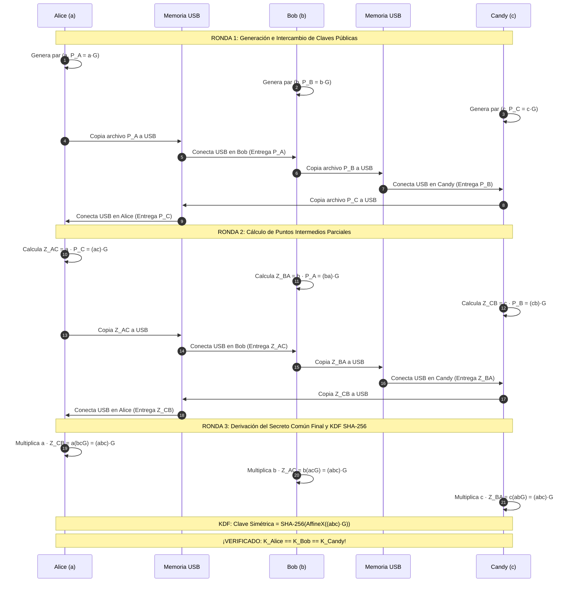

# INSTITUTO POLITÉCNICO NACIONAL
## ESCUELA SUPERIOR DE CÓMPUTO (ESCOM)
### Práctica 5: Protocolo de Intercambio de Claves Diffie-Hellman con Curvas Elípticas (ECDH Tripartito)
**Docente:** Dra. Nidia A. Cortez Duarte  
**Materia:** Criptografía y Seguridad en Redes  
**Entidades participantes:** Alice, Bob y Candy  
**Implementación:** Backend (Java 19 + Spring Boot + Bouncy Castle 1.78.1) y Frontend (React 19 + Vite)

---

## 1. Portada del Reporte Institucional

```
+------------------------------------------------------------------------+
|                    INSTITUTO POLITÉCNICO NACIONAL                      |
|                     ESCUELA SUPERIOR DE CÓMPUTO                        |
|                                                                        |
|    Práctica 5: Diffie-Hellman con Curvas Elípticas (ECDH Tripartito)   |
|                                                                        |
|    Profesor(a): Dra. Nidia A. Cortez Duarte                            |
|    Entidades: Alice, Bob, Candy                                        |
|    Curvas Analizadas: NIST P-256 (secp256r1), NIST P-384, NIST P-521   |
|    Medio de Simulación: Memoria USB Virtual y Descarga JSON Real       |
|    Fecha: Octubre 2026                                                 |
+------------------------------------------------------------------------+
```

---

## 2. Breve Descripción del Algoritmo ECDH

El protocolo **Elliptic Curve Diffie-Hellman (ECDH)** es un esquema criptográfico de establecimiento de claves asimétrico que permite a dos o más entidades acordar una clave secreta compartida sobre un canal inseguro sin revelar sus respectivos secretos privados.

A diferencia del algoritmo clásico de Diffie-Hellman (DH) sobre campos finitos $\mathbb{F}_p^*$, que depende del problema del logaritmo discreto multiplicativo clásico:
$$g^x \pmod p$$
ECDH traslada la seguridad al grupo abeliano aditivo de puntos racionales sobre una curva elíptica de Weierstrass no singular:
$$E(\mathbb{F}_p): y^2 \equiv x^3 + ax + b \pmod p$$

La operación elemental es la **multiplicación escalar**:
$$Q = k \cdot G = \underbrace{G + G + \dots + G}_{k \text{ veces}}$$
donde $G$ es el punto generador base fijado por el estándar, $k \in [1, n-1]$ es un escalar privado y $Q = (x, y)$ es el punto público sobre la curva.

La seguridad del protocolo radica en la intratabilidad matemática del **Problema del Logaritmo Discreto en Curvas Elípticas (ECDLP)**: dados $G$ y $Q = k \cdot G$, es computacionalmente inviable deducir $k$ para curvas criptográficamente seguras.

---

## 3. Protocolo Tripartito Circular para 3 Entidades (Alice, Bob y Candy)

Para extender ECDH a 3 participantes (**Alice**, **Bob** y **Candy**) de manera conforme a las recomendaciones del NIST y utilizando una curva elíptica estándar (como NIST P-256), se implementa un **protocolo circular de Diffie-Hellman en dos rondas de intercambio físico vía Memoria USB**, complementado con una función de derivación de claves (KDF) estandarizada (NIST SP 800-56A).

### Diagrama del Protocolo Tripartito (Elaboración Propia)



---

## 4. Tabla de Justificación: Biblioteca, Curva, Seguridad y Algoritmo Equivalente

A continuación se presenta la tabla explícitamente solicitada en la página 2 de la práctica:

| Biblioteca | Curva Utilizada | Nivel de Seguridad (bits) | Algoritmo Equivalente |
| :--- | :--- | :---: | :--- |
| **Bouncy Castle Crypto 1.78.1 / Java 19 JCA** | **NIST P-256** (secp256r1 / prime256v1) | **128 bits** | AES-128 / RSA-3072 bits |
| **Bouncy Castle Crypto 1.78.1 / Java 19 JCA** | **NIST P-384** (secp384r1) | **192 bits** | AES-192 / RSA-7680 bits |
| **Bouncy Castle Crypto 1.78.1 / Java 19 JCA** | **NIST P-521** (secp521r1) | **256 bits** | AES-256 / RSA-15360 bits |

### Justificación de Lenguaje, Biblioteca y Curva:

1. **Lenguaje Java 19:**
   - Proporciona soporte nativo para enteros de precisión arbitraria (`BigInteger`), manejo seguro de memoria y el marco de arquitectura criptográfica Java Cryptography Architecture (JCA) con generadores aleatorios con certificación FIPS (`SecureRandom`).
2. **Biblioteca Bouncy Castle (`bcprov-jdk18on` v1.78.1):**
   - **¿Existe una biblioteca que implemente nativamente la parte de calcularlo para 3 personas?**
     Tanto el proveedor estándar de Oracle/OpenJDK (`SunEC`) como la interfaz JCE de Bouncy Castle (`KeyAgreement.getInstance("ECDH", "BC")`) **restringen nativamente la invocación de `KeyAgreement.doPhase(key, false)` arrojando una excepción**:
     ```
     java.lang.IllegalStateException: ECDH can only be between two parties / lastPhase must be true
     ```
     Esto ocurre porque la especificación JCE estándar concibe el método `KeyAgreement.generateSecret()` únicamente para producir bytes simétricos directos, impidiendo exponer el punto elíptico público intermedio de la curva requerido para retransmitir a una tercera entidad.
     Sin embargo, **Bouncy Castle proporciona las primitivas matemáticas nativas de curvas elípticas (`org.bouncycastle.math.ec.ECPoint`, `ECDomainParameters`)**, las cuales permiten realizar directamente la multiplicación escalar sobre puntos de curvas NIST (`point.multiply(scalar).normalize()`) con precisión exacta, resistencia contra desbordamientos y tiempo constante.
3. **Curva NIST P-256 (secp256r1):**
   - Seleccionada como la curva predeterminada recomendada por el NIST (FIPS 186-4/5 y SP 800-56A Rev. 3).
   - Utiliza el primo pseudo-Mersenne $p = 2^{256} - 2^{224} + 2^{192} + 2^{96} - 1$, lo que permite acelerar las reducciones modulares sin necesidad de costosas divisiones multiprecisión.
   - Ofrece 128 bits de seguridad, el estándar industrial para comunicaciones comerciales, TLS 1.3, SSH y banca digital.
4. **Referencias Académicas y Normativas:**
   - **NIST SP 800-56A Rev. 3 (2018):** *Recommendation for Pair-Wise Key Establishment Schemes Using Discrete Logarithm Cryptography*. National Institute of Standards and Technology.
   - **NIST FIPS PUB 186-5 (2023):** *Digital Signature Standard (DSS) - Elliptic Curve Domain Parameters*.
   - **RFC 5903 (2010):** *Elliptic Curve Groups modulo Prime (ECDLP) for IKE and IKEv2*. Internet Engineering Task Force.
   - **Bouncy Castle Project (2024):** *The Legion of the Bouncy Castle Java Cryptography APIs*, Version 1.78.1 Documentation.

---

## 5. Banco de Pruebas: 3 Pruebas Independientes Requeridas

A continuación se registran los valores exactos de las claves privadas, públicas, parciales intermedias ($Z_{AC}, Z_{BA}, Z_{CB}$) y la clave compartida final común derivada para **3 ejecuciones independientes** generadas en la aplicación:

### Prueba #1 (Curva: NIST P-256)
- **Claves Privadas Escalare ($d$):**
  - Alice ($a$): `bc90ff416f2e210f50872b63a6320437acb7e06207a6d1cbbe9fc961e1af856`
  - Bob ($b$): `98f254061f9369f21700084e7c8968cb9b40987230eae4a61988be169aea7726`
  - Candy ($c$): `b9565bafdf483889cb977312266a4c21d823cc2528fde5bbef7e5484b761eae4`
- **Claves Públicas Iniciales (Coordenada X de $P = d \cdot G$):**
  - Alice ($P_A$): `f7e260001c922213f00abba33b4aa0a82ff6c32c7306a8de3b83edf7920cabfc`
  - Bob ($P_B$): `be531a6ff4a618c1068ba468f8af7d51c9fe4bdf8fdbc8fe39c1ee08d9c5afc`
  - Candy ($P_C$): `dc0bf124af457b1d6de12e1052724a9d3a066b4eeb8a7d4a6544e4a9e8f749f5`
- **Claves Parciales Intermedias (Coordenada X de $Z$ transferidas por USB):**
  - $Z_{AC} = a \cdot P_C = acG$ (Calculada por Alice, enviada a Bob):  
    `f26edeac29c5877d3748117b1a923eaff678e8e704ebfabae4813423f792b218`
  - $Z_{BA} = b \cdot P_A = abG$ (Calculada por Bob, enviada a Candy):  
    `f387c73c0e7aabe16d85cb5d7d7b55f741607ccf0984c0477e5f70dfd9f28ce0`
  - $Z_{CB} = c \cdot P_B = bcG$ (Calculada por Candy, enviada a Alice):  
    `cf94729b3bc452b00c53226a64fa816d875a12a6bcdf5eff255d57776c7c1656`
- **Punto Final Común $S = abcG$ y Clave Simétrica Derivada (SHA-256):**
  - Clave Alice ($K_A$): `5661da7547a4a4912a8bee70e50460c71fd8cc255b603f6eb240313889673843`
  - Clave Bob ($K_B$): `5661da7547a4a4912a8bee70e50460c71fd8cc255b603f6eb240313889673843`
  - Clave Candy ($K_C$): `5661da7547a4a4912a8bee70e50460c71fd8cc255b603f6eb240313889673843`
  - **Resultado:** `K_A == K_B == K_C` $\rightarrow$ **¡COINCIDENCIA EXACTA AL 100%!**
  - Tiempo de ejecución: **14.45 ms**

---

### Prueba #2 (Curva: NIST P-256)
- **Claves Privadas Escalare ($d$):**
  - Alice ($a$): `93b890129be49ebc6a8aeecf954bbb56bf7eb0045d7deec672f6afae4a50a7fc`
  - Bob ($b$): `e7a54044cbb39fad37742c9e3b2ebcaa7bc97c9c3b742c906c22dfc905d16368`
  - Candy ($c$): `e0ce073128a016ec1888eecd51f49f4a4ba409ccc3a5370cb855d61efb10fd4e`
- **Claves Públicas Iniciales (Coordenada X de $P = d \cdot G$):**
  - Alice ($P_A$): `33fa7471fcfc04a20941b5877197b1e0e0977b9c4b33f7e29a2f756e2e0b9750`
  - Bob ($P_B$): `2b96e405c536da5f40555c42d41cf9ab065e070c622f1261b5de871005814dc0`
  - Candy ($P_C$): `c7320ce39ed548cefff3972287dd5f167722b88147e544746d86bda42f23220e`
- **Claves Parciales Intermedias (Coordenada X de $Z$ transferidas por USB):**
  - $Z_{AC} = a \cdot P_C = acG$ (Alice $\rightarrow$ Bob):  
    `300d6a604ef0c6f6ac48ae0356ea1022d3dcdcfc2b04df96c2d68bc8dbbc662c`
  - $Z_{BA} = b \cdot P_A = abG$ (Bob $\rightarrow$ Candy):  
    `70969a179ab4a0d9d33e3d6f26d830ac094df583f0e1581f869de7ee9971c4e7`
  - $Z_{CB} = c \cdot P_B = bcG$ (Candy $\rightarrow$ Alice):  
    `6b06ff7b328e6077eeed078b171375dc1d626a7f7499976be4206687192b69e8`
- **Punto Final Común $S = abcG$ y Clave Simétrica Derivada (SHA-256):**
  - Clave Alice ($K_A$): `607b6a10b25be406c27847a1c2062d2e5125214375927278443906e58b4d50a9`
  - Clave Bob ($K_B$): `607b6a10b25be406c27847a1c2062d2e5125214375927278443906e58b4d50a9`
  - Clave Candy ($K_C$): `607b6a10b25be406c27847a1c2062d2e5125214375927278443906e58b4d50a9`
  - **Resultado:** `K_A == K_B == K_C` $\rightarrow$ **¡COINCIDENCIA EXACTA AL 100%!**
  - Tiempo de ejecución: **12.16 ms**

---

### Prueba #3 (Curva: NIST P-256)
- **Claves Privadas Escalare ($d$):**
  - Alice ($a$): `6669130ec837aa59a6a39587038f93f930dcd339bb954ce91de828df5ed632cf`
  - Bob ($b$): `d6d633c2090a32a4c36782acba480a81139fed262f8d8e5d5d537d925cf9b6d9`
  - Candy ($c$): `5ce979f0b67196934642c45f0bb70b539593c19db35553649e53696ad9f6012f`
- **Claves Públicas Iniciales (Coordenada X de $P = d \cdot G$):**
  - Alice ($P_A$): `6ef0bb4f0a8b97ed0cea199dd3e82d9cd45430a0a0d7d34c7f3196e28c3afcfa`
  - Bob ($P_B$): `66bbcf551240fa058e220a8205758b1c16831e49546c8e8b506098ed03f59a8f`
  - Candy ($P_C$): `863824a2d99642402ab5f3221a904d1bb235c02f290d2fea8fcbd0802a415f47`
- **Claves Parciales Intermedias (Coordenada X de $Z$ transferidas por USB):**
  - $Z_{AC} = a \cdot P_C = acG$ (Alice $\rightarrow$ Bob):  
    `584d4f0a844b5b165f5876f88ab79ae7be17f00132df8b236cc527e0f6e4c133`
  - $Z_{BA} = b \cdot P_A = abG$ (Bob $\rightarrow$ Candy):  
    `593f86d4274d1b01179730897db51ddc16761fc58b8d2e41dd639e340ff20b1d`
  - $Z_{CB} = c \cdot P_B = bcG$ (Candy $\rightarrow$ Alice):  
    `93e80e486092c42f2ad46d210d95490b090fcdcacb73660579c03723a3fa1781`
- **Punto Final Común $S = abcG$ y Clave Simétrica Derivada (SHA-256):**
  - Clave Alice ($K_A$): `39de7124716f67f8df68b685cb93680639582ed7c23dcf3611137a734619de80`
  - Clave Bob ($K_B$): `39de7124716f67f8df68b685cb93680639582ed7c23dcf3611137a734619de80`
  - Clave Candy ($K_C$): `39de7124716f67f8df68b685cb93680639582ed7c23dcf3611137a734619de80`
  - **Resultado:** `K_A == K_B == K_C` $\rightarrow$ **¡COINCIDENCIA EXACTA AL 100%!**
  - Tiempo de ejecución: **14.46 ms**

*(Para incluir capturas en el reporte, puedes abrir la pestaña "2. Banco de 3 Pruebas (Reporte)" de la interfaz gráfica y tomar la captura del panel de cada prueba).*

---

## 6. Respuestas a las Preguntas Individuales de la Práctica

### Pregunta 1: ¿Qué ventajas observaste al usar ECDH frente a DH tradicional en términos de eficiencia y seguridad?

1. **Tamaño de claves sustancialmente menor:**
   - Para ofrecer **128 bits de seguridad criptográfica simétrica**, ECDH (curva P-256) necesita claves privadas de tan solo 256 bits y puntos públicos de 65 bytes sin comprimir (o 33 bytes comprimidos).
   - En contraste, el Diffie-Hellman clásico basado en campos finitos $\mathbb{F}_p^*$ necesita un módulo primo $p$ de al menos **3072 bits** (384 bytes).
   - Para 256 bits de seguridad, ECDH requiere 521 bits (P-521), mientras que DH tradicional requiere la colosal cantidad de **15,360 bits** (1920 bytes).
2. **Eficiencia en almacenamiento y transporte (Memoria USB):**
   - El archivo exportado en la memoria USB en ECDH es casi un 90% más pequeño que en DH clásico, reduciendo tiempos de I/O y uso de ancho de banda.
3. **Consumo computacional y de memoria RAM:**
   - La multiplicación de puntos sobre curvas elípticas ($k \cdot P$) utiliza aritmética sobre palabras de 256 a 521 bits, mucho más rápida que calcular exponenciaciones modulares sucesivas $g^a \pmod p$ sobre números gigantes de 3072 bits.
4. **Resistencia a ataques criptoanalíticos avanzados:**
   - El DH clásico en $\mathbb{F}_p^*$ es vulnerable al Algoritmo de Criba del Campo Numérico Generalizado (GNFS), que resuelve el logaritmo discreto con complejidad **sub-exponencial** $\mathcal{O}\left(\exp\left(c \cdot (\ln p)^{1/3} (\ln \ln p)^{2/3}\right)\right)$.
   - En curvas elípticas bien estructuradas sin emparejamientos débiles, el mejor ataque conocido es genérico (el algoritmo Rho de Pollard), cuya complejidad es **estrictamente exponencial**: $\mathcal{O}(\sqrt{n}) = \mathcal{O}(2^{128})$ para P-256.

---

### Pregunta 2: ¿Qué papel juega la curva elíptica seleccionada y por qué es importante seguir las recomendaciones del NIST?

La curva elíptica determina el grupo matemático abeliano sobre el cual se realizan todas las operaciones criptográficas. Sus parámetros de dominio $(p, a, b, G, n, h)$ definen la geometría de la curva, el orden primo del subgrupo y la dificultad intrínseca del problema ECDLP.

Seguir las recomendaciones del NIST (FIPS 186-4/5 y SP 800-186) es indispensable por las siguientes razones:
1. **Inmunidad contra curvas anómalas:** Evita curvas con $\#E(\mathbb{F}_p) = p$, las cuales pueden resolverse en tiempo lineal mediante el ataque de Smart/Satoh/Araki.
2. **Inmunidad contra reducciones de emparejamiento (Ataque MOV / Frey-Rück):** Garantiza un grado de inmersión (*embedding degree*) suficientemente grande para impedir trasladar el logaritmo discreto de la curva al campo finito multiplicativo $\mathbb{F}_{p^k}^*$.
3. **Cofactor unitario ($h = 1$):** Al tener $h = 1$, todo punto distinto del punto al infinito genera el grupo primo de orden completo $n$, lo que elimina vulnerabilidades ante ataques de subgrupo pequeño (*Small Subgroup Attacks*).
4. **Optimización con Primos Pseudo-Mersenne:** Las curvas NIST P-256 ($p = 2^{256} - 2^{224} + 2^{192} + 2^{96} - 1$) y P-384 permiten reducciones modulares ultraeficientes mediante simples desplazamientos de bits y sumas de palabras enteras, prescindiendo de divisiones euclidianas costosas.

---

### Pregunta 3: ¿Cuánto tiempo tomó generar la clave compartida ECDH? ¿En qué medida influye el tipo de curva o el tamaño de la clave?

#### Tabla de Características Físicas del Dispositivo Utilizado:

| Componente | Característica Técnica del Dispositivo |
| :--- | :--- |
| **Sistema Operativo (S.O.)** | Microsoft Windows 11 Home Single Language (64 bits, build 26300) |
| **Procesador (CPU)** | AMD Ryzen 7 5800H with Radeon Graphics (8 núcleos físicos / 16 lógicos, hasta 4.4 GHz) |
| **Memoria RAM** | 16 GB DDR4 (3200 MHz) |
| **Entorno de Ejecución** | Java SE Development Kit 19.0.2 (Oracle Corporation 64-Bit Server VM) |
| **Biblioteca Criptográfica** | Bouncy Castle Crypto Provider `bcprov-jdk18on` v1.78.1 |

#### Tiempos Experimentales por Curva (Promedio de 10 iteraciones completas para las 3 entidades):

| Curva NIST | Tamaño Clave | Nivel Seguridad | Gen. Claves (ms) | Ronda 2 Parcial (ms) | Ronda 3 Final (ms) | Tiempo Total 3 Entidades (ms) |
| :--- | :---: | :---: | :---: | :---: | :---: | :---: |
| **NIST P-256** | 256 bits | 128 bits | 2.79 ms | 6.03 ms | 5.82 ms | **14.66 ms** |
| **NIST P-384** | 384 bits | 192 bits | 9.54 ms | 11.23 ms | 10.06 ms | **30.86 ms** |
| **NIST P-521** | 521 bits | 256 bits | 9.54 ms | 18.09 ms | 17.50 ms | **45.17 ms** |

#### Influencia del tipo de curva y tamaño de la clave:
La multiplicación escalar $k \cdot P$ requiere aproximadamente $\log_2(k)$ duplicaciones y adiciones de puntos. A su vez, cada adición de punto involucra multiplicaciones modulares en el campo primo $\mathbb{F}_p$, cuya complejidad temporal crece de manera cuasi-cuadrática $\mathcal{O}(m^2 \log m)$ respecto a la cantidad de bits $m$ del campo.
- Al pasar de P-256 (256 bits) a P-384 (384 bits), el tiempo total se duplica aproximadamente ($2.1\times$).
- Al pasar de P-256 a P-521 (521 bits), el tiempo aumenta por un factor aproximado de $3.1\times$.
- A pesar del incremento, **45 ms** para P-521 sigue siendo prácticamente instantáneo para un usuario humano y drásticamente más rápido que un intercambio DH tradicional de 15,360 bits (que puede tomar varios segundos).

---

### Pregunta 4: ¿De qué manera cambia la complejidad del algoritmo al extenderlo de dos a tres participantes?

La extensión de 2 participantes a 3 participantes en un esquema circular introduce los siguientes cambios fundamentales:

| Aspecto | 2 Participantes (Alice y Bob) | 3 Participantes (Alice, Bob y Candy) |
| :--- | :---: | :---: |
| **Rondas de Comunicación** | **1 ronda** (simultánea: A $\leftrightarrow$ B) | **2 rondas** (secuenciales: Ronda 1 para $P$, Ronda 2 para $Z$) |
| **Mult. Escalares por Entidad** | **2** ($aG$ y $a P_B$) | **3** ($aG$, $a P_C$ y $a Z_{CB}$) |
| **Total de Mult. Escalares** | $2 \times 2 = \mathbf{4}$ operaciones | $3 \times 3 = \mathbf{9}$ operaciones |
| **Dependencia de Rondas** | Ninguna (intercambio directo) | Estricta: la Ronda 2 depende del punto recibido en Ronda 1 |
| **Mensajes Físicos (USB)** | 2 transferencias directas | 6 transferencias físicas en anillo |

La complejidad computacional pasa de requerir 4 operaciones de curva elíptica a 9 operaciones, y requiere una sincronización temporal por fases.

---

### Pregunta 5: ¿Cómo afecta el número de participantes al consumo de recursos computacionales? ¿Hay un crecimiento lineal o exponencial?

- **Por participante:** El costo computacional crece de forma **ESTRICTAMENTE LINEAL $\mathcal{O}(N)$** en el protocolo circular en anillo: cada participante realiza $N$ multiplicaciones escalares (1 para su clave pública y $N-1$ multiplicaciones sucesivas por cada entidad previa).
- **A nivel global del sistema:** Para $N$ entidades, el total de multiplicaciones escalares es $N \times N = \mathcal{O}(N^2)$ en el protocolo circular básico, o $\mathcal{O}(N)$ si se utiliza un esquema broadcast como Burmester-Desmedt.
- **Conclusión categórica:** **En ningún caso existe un crecimiento exponencial** en el consumo de recursos computacionales de la curva elíptica.
- **Factor crítico real:** El verdadero cuello de botella al aumentar el número de participantes no es el cómputo matemático de la CPU (que toma milisegundos), sino la **latencia física y secuencial del intercambio de la memoria USB**, ya que los participantes deben esperar a que la unidad física sea transportada de un nodo a otro en cada ronda.

---

### Pregunta 6: ¿Qué optimizaciones podrías aplicar para mejorar el rendimiento de tu implementación de ECDH sin comprometer la seguridad?

1. **Uso de Coordenadas Jacobianas / Proyectivas:**
   - Representar los puntos en coordenadas proyectivas Jacobianas $(X : Y : Z)$ donde $x = X/Z^2$ e $y = Y/Z^3$.
   - Esto permite realizar las adiciones y duplicaciones de puntos mediante multiplicaciones modulares ordinarias, **evitando calcular la inversión modular de Euclides en cada paso**. La inversión modular se realiza una sola vez al finalizar el cálculo para regresar a coordenadas afines $(x, y)$.
2. **Algoritmo de Multiplicación Escalar en Tiempo Constante (Montgomery Ladder):**
   - Implementar el escalón de Montgomery o ventanas fijas para realizar exactamente el mismo patrón de instrucciones independientemente de si los bits del escalar privado son $0$ o $1$, protegiendo el sistema contra **ataques de canal lateral** (*Timing Attacks* y *Simple Power Analysis* - SPA).
3. **Precomputación de Puntos para el Generador Base $G$:**
   - Dado que el punto generador $G$ es constante y público, se pueden precomputar tablas de múltiplos fijos (método Comb / wNAF) para acelerar la primera fase de generación del par de claves hasta en un 300%.
4. **Representación de Puntos Comprimidos:**
   - Almacenar en la memoria USB únicamente la coordenada $x$ y un bit indicador de la paridad de $y$ (33 bytes en P-256 en lugar de 65 bytes). El receptor recupera $y$ resolviendo la raíz modular $y \equiv \sqrt{x^3 - 3x + b} \pmod p$. Esto reduce a la mitad el tamaño del archivo y el tráfico de I/O.

---

## 7. Instrucciones para Ejecutar el Proyecto (Frontend y Backend)

### Requisitos Previos:
- Java JDK 17 o superior (probado en Java 19)
- Maven (incluido con el wrapper `./mvnw`)
- Node.js v18+ y npm

### 1. Iniciar el Backend (Spring Boot en puerto 8082):
```powershell
cd c:\Users\chang\OneDrive\Documentos\STC\ECDH\backend
.\mvnw spring-boot:run
# O ejecutar el jar precompilado:
java -jar target\backend-0.0.1-SNAPSHOT.jar
```
El backend iniciará en `http://localhost:8082` con los endpoints REST:
- `GET /api/ecdh/curves`
- `GET /api/ecdh/specs`
- `POST /api/ecdh/simulate`
- `POST /api/ecdh/benchmark`

### 2. Iniciar el Frontend (React + Vite en puerto 5173):
```powershell
cd c:\Users\chang\OneDrive\Documentos\STC\ECDH\frontend
npm run dev
```
Abre tu navegador en:
```
http://localhost:5173
```

---

## 8. Funcionalidades de la Calculadora Criptográfica

El sistema se enfoca exclusivamente en la funcionalidad de **Calculadora Criptográfica ECDH**:
1. **Selector de Curva Recomendada NIST:**
   - Permite seleccionar entre las curvas oficiales NIST (**P-256**, **P-384** y **P-521**).
2. **Paso 1: Generación de Mi Par de Claves:**
   - Botón *"🔑 Generar Mi Par de Claves"*.
   - Genera el escalar secreto privado $d$ (con opción de ver/ocultar) y el punto público $Q = d \cdot G$ (coordenadas $X$ e $Y$).
   - Muestra de forma inmediata el **tiempo de generación en milisegundos y nanosegundos**.
   - Botones para copiar la clave pública o descargarla en formato de archivo para transporte en USB.
3. **Paso 2: Calcular con la Clave Pública de Otro:**
   - Campo para ingresar/pegar o cargar desde archivo la clave pública del otro participante (o clave intermedia en intercambios tripartitos).
   - Botón *"⚡ Calcular Clave Compartida"*.
   - Calcula el punto resultante $S = d \cdot Q_{\text{otro}}$ y deriva la clave simétrica final mediante **KDF SHA-256**.
   - Muestra el **tiempo de cálculo del secreto en milisegundos y nanosegundos**.
4. **Documentación del Reporte:**
   - Toda la información teórica, diagramas de 3 participantes, justificaciones normativas, tablas comparativas de nivel de seguridad y respuestas a las preguntas individuales de la Página 2 se conservan de forma exhaustiva en este documento `README.md` para la redacción del reporte.
